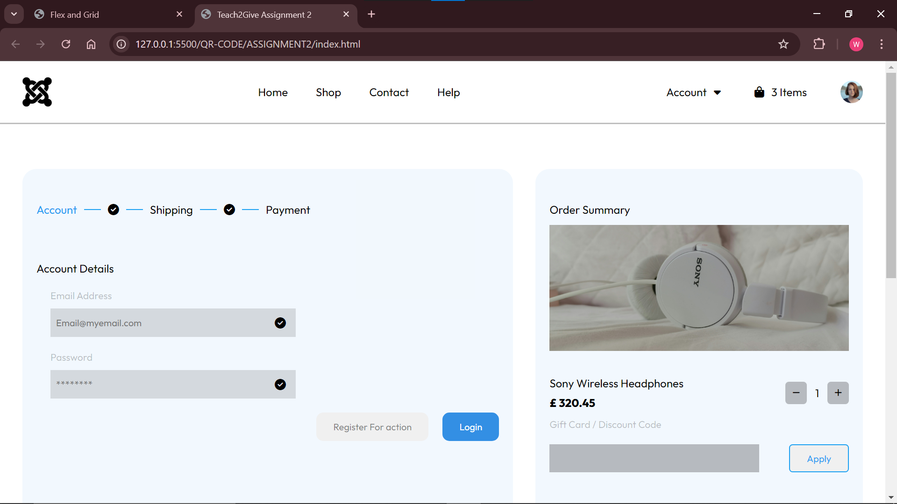
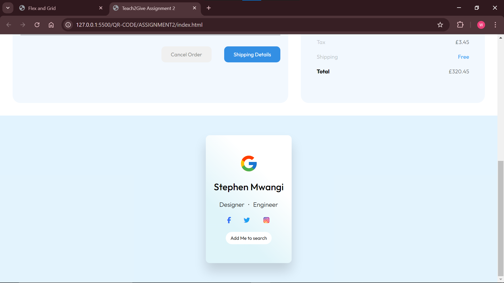

# Basic Guide

This is a simple webpage which uses HTML and CSS

The first image represents a webpage that applies flex. The webpage uses CSS properties such as

 1. Display - flex (Aligns items along the main or cross axis)  By default the flex property    utilizes the main axis(X axis).

 2. To align items along the y axis, the CSS property - `flex-direction:column;` is used

 Additionally the web page utilizes `container` HTML tags elements such as `nav` which is used to create navigation bar, `section`,`div`,`main` used to add main content of a web page,`aside` used to add a side bar or a quote inside a blog

The second image also represents a webpage that applies flex. The webpage uses CSS properties such as

 1. Display - flex (Aligns items along the main or cross axis)
 2. To align items along the y axis, the CSS property - `flex-direction:column;` is used

 This business card utilizes CSS properties such as `gap` which adds horizontal or vertical space between elements inside a container, `padding` which adds space between the edge of a container and its contents.

