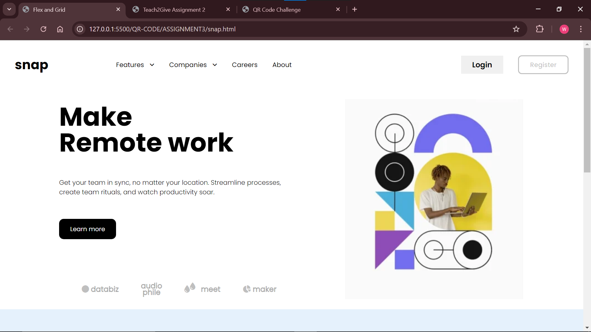

# Basic Guide

This is a simple webpage which uses HTML and CSS

The first image represents a webpage that applies flex . The webpage uses CSS properties such as

 1. Display - flex (Aligns items along the main or cross axis)  By default the flex property    utilizes the main axis(X axis).

 2. To align items along the y axis, the CSS property - `flex-direction:column;` is used

The second image is a webpage that utilizes the CSS grid property.The CSS grid property `display:grid;`is used to arrange boxes which require complex arrangement. Cells inside a container are arranged as a grid which allows overlapping.The grid property supports arrangement of cells on the X-axis and y-axis through `rows` and `columns`. Columns are normally predetermined. The advantage of flex arrangement is the ability to grow as content increases.Additionally, subsequent boxes increase in height as other sibling boxes increase in height.

